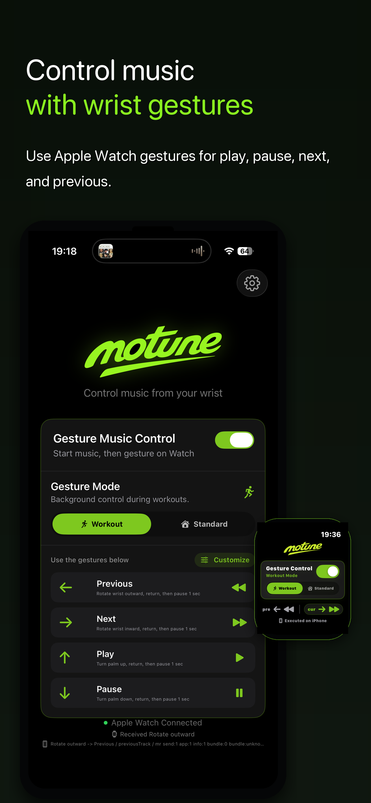
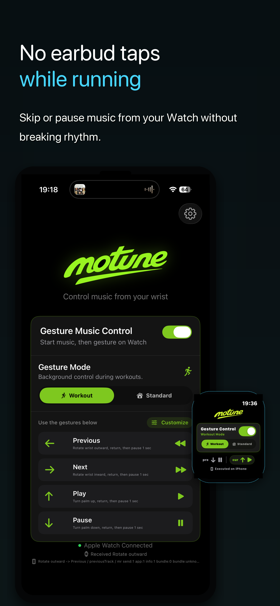
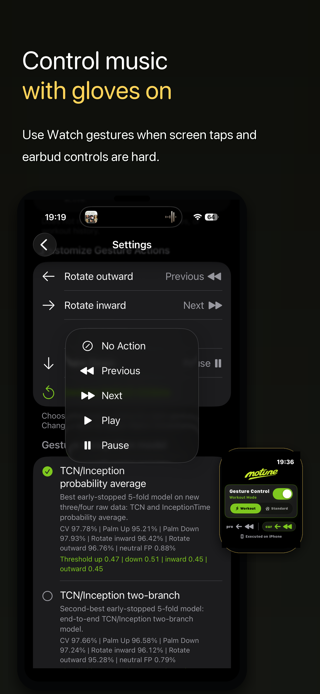
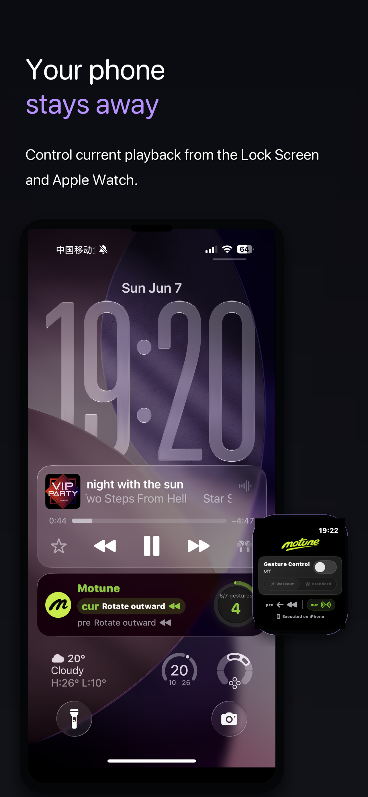
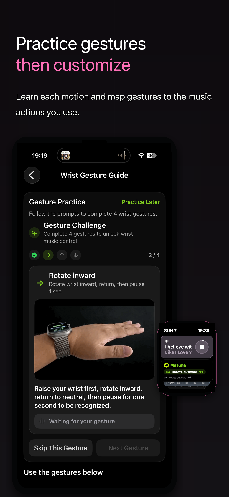
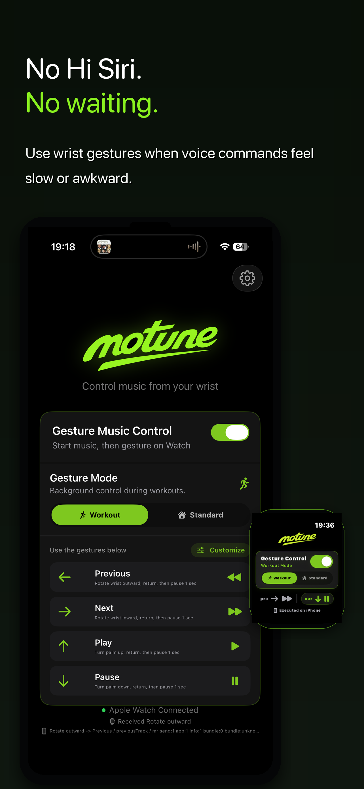

<section class="hero">
  

    
    
Apple Watch gesture music remote

    <h1>Control music without touching your earbuds or talking to Siri.</h1>
    
Motune turns your Apple Watch into a wrist gesture remote for music. It is built for running, cycling, commuting, winter gloves, open-ear headphones, earbud taps that misfire, and moments when screen taps or voice commands are inconvenient.

    

      <a href="https://apps.apple.com/us/app/motune/id6768014814?uo=4" class="button">Download on App Store</a>
      <a href="support" class="button secondary">Support</a>
    

  

  

    
  

</section>

<section class="download-card">
  

    
Download Motune

    <h2>Scan to open Motune on the App Store.</h2>
    
Use the QR code from another device, or open the App Store link directly on iPhone.

  

  

    
    <a href="https://apps.apple.com/us/app/motune/id6768014814?uo=4" class="app-store-badge compact" aria-label="Download Motune on the App Store">
      
      
        <small>Download on the</small>
        <strong>App Store</strong>
      
    </a>
    Scan with iPhone camera
  

</section>

## Built Around Real Music-Control Friction

  

    <h3>No tiny earbud taps</h3>
    
Earbud controls are useful, but tiny taps and squeezes can misfire while running, sweating, adjusting fit, wearing a hat, or moving fast.

  

  

    <h3>No awkward voice commands</h3>
    
Siri is helpful, but saying music commands out loud can feel slow, awkward in public, or unreliable in wind, traffic, and noisy gyms.

  

  

    <h3>No small screen taps</h3>
    
Apple Watch Now Playing works when you can look down and tap. Motune is for moments when your eyes, hands, or gloves make that inconvenient.

  

  

    <h3>Built for motion</h3>
    
Use wrist gestures for play, pause, next, and previous while running, cycling, walking, commuting, cooking, or carrying things.

  

## User Stories

  

    
Runner with earbuds

    <h3>"I keep missing the earbud tap while running."</h3>
    
Motune lets the runner keep the phone away and use a clear wrist gesture for next track, previous track, play, or pause.

  

  

    
Winter walker

    <h3>"Gloves make tiny controls annoying."</h3>
    
Instead of pulling off gloves or hunting for the phone, the user can make one intentional Watch gesture, return to neutral, then continue walking.

  

  

    
Cyclist or open-ear headphone user

    <h3>"I do not want Siri in the wind or earbud taps in motion."</h3>
    
Motune can act as a wrist control layer for Shokz, open-ear headphones, bone conduction headphones, and everyday earbuds.

  

## V1.7 Screenshots

Version 1.7 focuses the App Store presentation around the clearest user moments: wrist gesture music control, running without earbud taps, glove-friendly control, phone-away playback, gesture practice, and no Siri waiting.

  <figure>
    
    <figcaption>Control music with wrist gestures</figcaption>
  </figure>
  <figure>
    
    <figcaption>No earbud taps while running</figcaption>
  </figure>
  <figure>
    
    <figcaption>Control music with gloves on</figcaption>
  </figure>
  <figure>
    
    <figcaption>Your phone stays away</figcaption>
  </figure>
  <figure>
    
    <figcaption>Practice gestures, then customize</figcaption>
  </figure>
  <figure>
    
    <figcaption>No Hi Siri. No waiting.</figcaption>
  </figure>

## What Motune Does

Motune is not another music player. It is a wrist gesture remote for the music app you already use. Start playback in your preferred app, enable Gesture Music Control, choose Standard Mode or Workout Mode, then use wrist gestures to play, pause, or switch tracks without touching earbuds, speaking to Siri, or taking out your phone.

  

    <h3>Current playback control</h3>
    
Controls the current iPhone media session, including common Apple Music and Spotify playback states.

  

  

    <h3>Apple Watch gestures</h3>
    
Recognizes intentional wrist motions on Apple Watch and sends the action to iPhone.

  

  

    <h3>Standard or Workout Mode</h3>
    
Use Standard Mode while the Watch app is open, or start Workout Mode for running, walking, or training.

  

  

    <h3>Custom actions</h3>
    
Keep the default mapping, swap actions, or disable gestures you do not want to use.

  

## How It Works

1. Install Motune on iPhone and Apple Watch.
2. Start playback in your music app.
3. Open Motune and enable Gesture Music Control.
4. Choose Standard Mode or Workout Mode.
5. Make one clear gesture, return your wrist to neutral, then pause 1 second.
6. Motune recognizes the gesture on Apple Watch and controls the current playback on iPhone.

## FAQ

  

    <h3>What is Motune?</h3>
    
Motune is an Apple Watch wrist gesture remote for music. It lets you control the current iPhone playback session with Watch gestures instead of touching earbuds, talking to Siri, or opening a tiny control screen.

  

  

    <h3>Who is Motune for?</h3>
    
Motune is built for runners, cyclists, commuters, gym users, winter walkers, open-ear headphone users, and anyone who wants faster music controls when hands, voice, or screen taps are inconvenient.

  

  

    <h3>Why do I need Motune if my earbuds already have controls?</h3>
    
Earbud controls are useful, but they are not always reliable while running, cycling, sweating, wearing gloves, or adjusting the fit. Motune gives you another option: control music from your wrist instead of touching the earbuds.

  

  

    <h3>Why not just use Siri?</h3>
    
Siri can work, but music control is a tiny, frequent action. Saying commands out loud can feel slow, awkward in public, or unreliable in noisy places. Motune is silent and does not require voice commands.

  

  

    <h3>Why not use Apple Watch Now Playing?</h3>
    
Now Playing works when you can look at the screen and tap. During running, cycling, commuting, wearing gloves, or carrying something, eyes-free wrist gestures can be faster.

  

  

    <h3>Does Motune work with Spotify, Apple Music, or Shokz?</h3>
    
Motune controls system-level media playback. It can be useful with Apple Music, Spotify, AirPods, Shokz, open-ear headphones, bone conduction headphones, and other earbuds when current playback supports system media controls.

  

  

    <h3>What apps can Motune control?</h3>
    
Motune can control the current iPhone playback session when the app responds to iOS system media commands. Common use cases include Apple Music, Spotify, YouTube Music, YouTube, Podcasts, Audible, Overcast, Pocket Casts, TikTok audio or video playback, QQ Music, NetEase Cloud Music, KuGou Music, Kuwo Music, and other audio apps that support system playback controls.

  

  

    <h3>Does Motune support Spotify?</h3>
    
Motune can be useful with Spotify when Spotify is the current playback source and responds to iPhone system media controls. Many users look for this because Apple Watch Double Tap and Spotify workflows do not always feel direct enough.

  

  

    <h3>Does Motune support YouTube Music, YouTube, TikTok, or TikTok Music?</h3>
    
Motune is not tied to one music service. If YouTube Music, YouTube, TikTok, TikTok Music-style playback, or another media app exposes play, pause, next, or previous through iOS system media controls, Motune can send those commands from Apple Watch gestures.

  

  

    <h3>Does Motune support QQ Music or NetEase Cloud Music?</h3>
    
Motune can work with Chinese music apps such as QQ Music, NetEase Cloud Music, KuGou Music, Kuwo Music, and similar players when they respond to iOS system media controls for the current playback session.

  

  

    <h3>What headphones work well with Motune?</h3>
    
Motune is headphone-agnostic because it controls playback from Apple Watch and iPhone. It can fit AirPods, AirPods Pro, Beats, Shokz, Bose, Sony, open-ear headphones, bone conduction headphones, running earbuds, cycling headphones, gym earbuds, and winter-glove setups.

  

  

    <h3>How is Motune different from Siri, AirPods controls, Double Tap, and Now Playing?</h3>
    
Siri uses voice, AirPods and earbuds use tiny touch or button controls, Double Tap is a system gesture with limited context, and Now Playing needs screen attention. Motune is a dedicated Apple Watch wrist gesture remote for music actions you can customize.

  

  

    <h3>Is Motune a music player?</h3>
    
No. Motune is not a music streaming app and does not replace Spotify, Apple Music, or your favorite player. Start music in the app you already use, then use Motune as a Watch gesture remote for playback control.

  

  

    <h3>Can Motune help when Apple Watch Double Tap is not enough?</h3>
    
Motune is designed for people who want a dedicated music-control workflow on Apple Watch. It gives previous, next, play, and pause their own gesture mappings instead of depending on a single system gesture behavior.

  

  

    <h3>What music actions can I control?</h3>
    
Motune focuses on the core actions people need most often: previous track, next track, play, and pause. You can keep the default mapping or customize which gesture triggers which action.

  

  

    <h3>What gestures does Motune use?</h3>
    
Motune uses clear wrist motions such as rotate outward, rotate inward, palm up, and palm down. For best recognition, make one gesture, return your wrist to a relaxed neutral position, then pause briefly.

  

  

    <h3>What is Workout Mode?</h3>
    
Workout Mode is a user-started mode for active sessions such as running, walking, or training. It helps gesture control remain available during movement. Motune does not read heart rate, calories, activity rings, or workout history.

  

  

    <h3>Can I use Motune while running or cycling?</h3>
    
Motune is useful for in-motion music control, especially when earbud taps, phone access, or screen taps are awkward. It is still only a convenience tool for music playback, so users should always pay attention to surroundings.

  

  

    <h3>Does Motune help with winter gloves or bike gloves?</h3>
    
Yes, that is one of the main use cases. Gloves make small touch targets and earbud controls harder to use. Motune moves the music-control action to intentional Apple Watch wrist gestures.

  

  

    <h3>Does Motune work with open-ear or bone conduction headphones?</h3>
    
Motune can be a useful control layer for Shokz, open-ear headphones, bone conduction headphones, AirPods, and everyday earbuds when the current iPhone playback responds to system media commands.

  

  

    <h3>Does Motune collect personal data?</h3>
    
Motune does not require an account, does not include ads, and does not use third-party analytics SDKs. Motion data for gesture recognition is processed locally, and optional gesture samples stay local when intentionally saved.

  

  

    <h3>What do I need to use Motune?</h3>
    
You need an iPhone, a paired Apple Watch, Motune installed on both devices, and Apple Watch motion permission. Health permission is only needed if you choose to start Workout Mode.

  

  

    <h3>What should I do if a gesture is not recognized?</h3>
    
Use the gesture guide, make the motion clearly, return to neutral, and pause about one second before the next action. You can also adjust gesture actions or use the advanced recognition settings if you want more control.

  

## Safety & Privacy

- No account.
- No ads.
- No third-party analytics SDKs.
- No cross-app tracking.
- Motion sensor data is processed locally for gesture recognition.
- Motune is a convenience tool for music playback control. It is not intended for medical diagnosis, health treatment, emergency use, navigation, or safety-critical situations.

## Requirements

- iPhone running iOS 18 or later.
- Apple Watch running watchOS 11 or later.
- Motune installed on both iPhone and Apple Watch.
- Apple Watch paired and connected to iPhone.
- Motion permission on Apple Watch.
- Health permission only if the user starts Workout Mode.

## Languages

- [English](en)
- [简体中文](zh-Hans)
- [繁體中文](zh-Hant)
- [日本語](ja)
- [한국어](ko)
- [Español](es)
- [Français](fr)
- [Deutsch](de)
- [العربية](ar)

## App Store Review Links

  <a href="privacy">
    <strong>Privacy Policy</strong>
    Data collection, motion data, Health permission, music playback data, and contact.
  </a>
  <a href="support">
    <strong>Support</strong>
    Requirements, setup steps, troubleshooting, Watch install help, and support email.
  </a>
  <a href="safety">
    <strong>Safety & Privacy</strong>
    No account, no ads, no tracking, local motion processing, and non-medical use.
  </a>
  <a href="requirements">
    <strong>Requirements</strong>
    iOS, watchOS, paired Apple Watch, Motion permission, and optional Health permission.
  </a>

