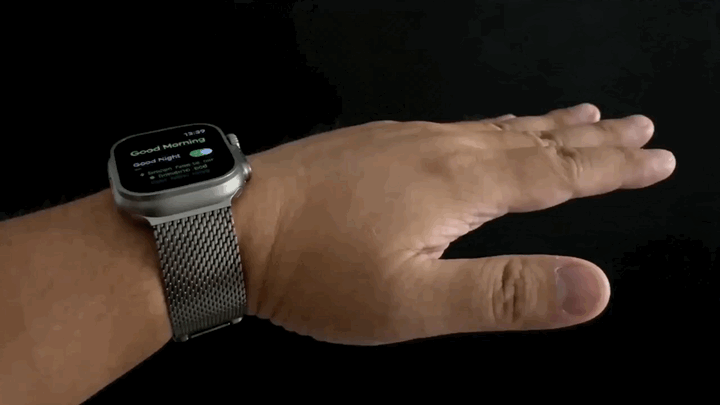
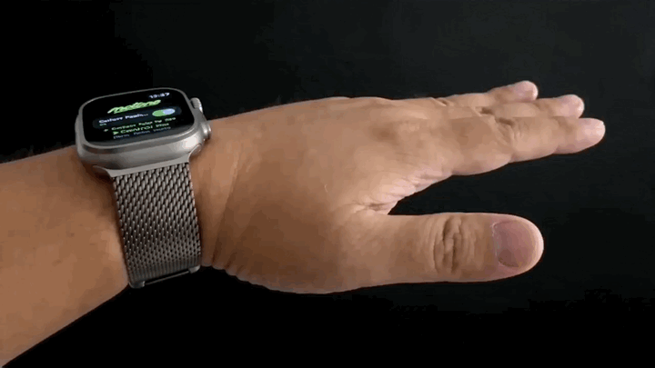
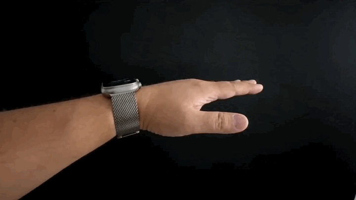
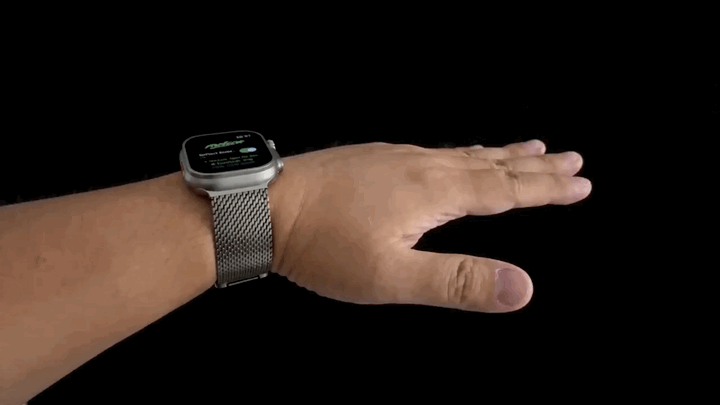

<section class="hero">
  

    
    
Apple Watch music control

    <h1>Control music from your wrist.</h1>
    
Motune lets you control current iPhone playback from Apple Watch with clear wrist gestures. It is built for running, walking, workouts, winter gloves, earbuds that are hard to tap, and any moment when your phone is in a pocket, armband, bag, or out of reach.

    

      <a href="https://apps.apple.com/us/app/motune/id6768014814?uo=4" class="button">Download on App Store</a>
      <a href="privacy.html" class="button secondary">Privacy Policy</a>
      <a href="support.html" class="button secondary">Support</a>
    

  

  

    
  

</section>

<section class="download-card">
  

    
Download Motune

    <h2>Scan to open Motune on the App Store.</h2>
    
Use the QR code from another device, or open the App Store link directly on iPhone.

    <a href="https://apps.apple.com/us/app/motune/id6768014814?uo=4" class="app-store-badge" aria-label="Download Motune on the App Store">
      
      
        <small>Download on the</small>
        <strong>App Store</strong>
      
    </a>
  

  

    
    Scan with iPhone camera
  

</section>

## Built Around Real Music-Control Friction

  

    <h3>Earbud taps miss mid-run</h3>
    
Small touch targets are easy to miss when your arm is moving, your breathing is up, or you are wearing a hat, gloves, or layers.

  

  

    <h3>Gloves make controls messy</h3>
    
Winter runs, cycling gloves, and cold-weather walks make phone and earbud controls less reliable.

  

  

    <h3>The phone is not reachable</h3>
    
Your iPhone may be in a pocket, belt, armband, bag, stroller, or across the room while music is already playing.

  

  

    <h3>One gesture is not enough</h3>
    
Motune maps multiple wrist gestures to playback actions, so next, previous, play, and pause can each have a dedicated motion.

  

## User Stories

  

    
Runner with earbuds

    <h3>"I keep missing the earbud tap while running."</h3>
    
Motune lets the runner keep the phone away and use a clear wrist gesture for next track, previous track, play, or pause.

  

  

    
Winter walker

    <h3>"Gloves make tiny controls annoying."</h3>
    
Instead of pulling off gloves or hunting for the phone, the user can make one intentional Watch gesture, return to neutral, then continue walking.

  

  

    
Cyclist or scooter rider

    <h3>"My phone is mounted, pocketed, or not safe to touch."</h3>
    
Motune gives playback control from the wrist, so the user does not need to reach for the phone just to skip a track.

  

  

    
Gym session

    <h3>"My hands are busy between sets."</h3>
    
When hands are holding weights, straps, towels, or equipment, wrist gestures keep music control available without breaking flow.

  

  

    
Phone in pocket or armband

    <h3>"I do not want to dig out the phone for one song."</h3>
    
Motune controls the current iPhone playback session from Apple Watch, so the phone can stay where it is.

  

  

    
Multiple music actions

    <h3>"I need more than one generic gesture."</h3>
    
Motune uses four wrist gestures by default, so previous, next, play, and pause can each have their own motion.

  

## V1.5 Screenshots

Version 1.5 refreshes the iPhone and Apple Watch experience with clearer Workout Mode status, custom gesture actions, advanced recognition settings, Lock Screen Live Card visibility, and guided gesture practice.

  <figure>
    
    <figcaption>Workout Mode with wrist controls</figcaption>
  </figure>
  <figure>
    
    <figcaption>Choose what each gesture does</figcaption>
  </figure>
  <figure>
    
    <figcaption>Advanced gesture models</figcaption>
  </figure>
  <figure>
    
    <figcaption>Gesture status on Lock Screen</figcaption>
  </figure>
  <figure>
    
    <figcaption>Practice before you start</figcaption>
  </figure>

## What Motune Does

Motune turns Apple Watch into a gesture remote for iPhone music playback. Start music in your preferred app, enable Gesture Music Control, choose Standard Mode or Workout Mode, then use wrist gestures to play, pause, or switch tracks without taking out your phone.

  

    <h3>Current playback control</h3>
    
Controls the current media session on iPhone instead of becoming another music player.

  

  

    <h3>Apple Watch gestures</h3>
    
Recognizes intentional wrist motions on Apple Watch and sends the action to iPhone.

  

  

    <h3>Standard or Workout Mode</h3>
    
Use Standard Mode while the Watch app is open, or start Workout Mode when you want control during active sessions.

  

  

    <h3>Custom actions</h3>
    
Keep the default mapping, swap actions, or disable gestures you do not want to use.

  

## V1.5 Highlights

- Improved iPhone Lock Screen Live Activity with clearer current action, previous action, and daily gesture count.
- Improved Apple Watch Live Activity for Smart Stack with compact current and previous action status.
- Refined Apple Watch Home status and disabled-state styling.
- Improved iPhone Home and Watch Home spacing for better readability.
- Guided gesture practice helps users learn wrist motions before real playback control.
- Advanced gesture model and threshold settings remain available for users who want more control.

## How It Works

1. Install Motune on iPhone and Apple Watch.
2. Start playback in your music app.
3. Open Motune and enable Gesture Music Control.
4. Choose Standard Mode or Workout Mode.
5. Make one clear gesture, return your wrist to neutral, then pause 1 second.
6. Motune recognizes the gesture on Apple Watch and controls the current playback on iPhone.

Workout Mode is started by the user. It uses a workout runtime so gesture control can remain available during running, walking, or training. Motune does not read heart rate, steps, calories, workout history, activity rings, or other health records.

## Gesture Guide

  <figure>
    
    <figcaption><strong>Rotate outward</strong> Previous track</figcaption>
  </figure>
  <figure>
    
    <figcaption><strong>Rotate inward</strong> Next track</figcaption>
  </figure>
  <figure>
    
    <figcaption><strong>Palm up</strong> Play</figcaption>
  </figure>
  <figure>
    
    <figcaption><strong>Palm down</strong> Pause</figcaption>
  </figure>

For best recognition, make each gesture clearly, use enough movement range, return your wrist to a relaxed position, then pause 1 second before the next gesture.

<h2 id="safety">Safety & Privacy</h2>

Motune is designed as a focused local utility:

- No account.
- No ads.
- No third-party analytics SDKs.
- No cross-app tracking.
- Motion sensor data is processed locally for gesture recognition.
- Optional gesture samples are saved locally only when the user intentionally uses the local sample tool.
- Music playback information is used locally for display and control.
- Motune is a convenience tool for music playback control. It is not intended for medical diagnosis, health treatment, emergency use, navigation, or safety-critical situations.

For the full App Store policy page, see [Privacy Policy](privacy.html). For troubleshooting and contact, see [Support](support.html).

<h2 id="requirements">Requirements</h2>

- iPhone running iOS 18 or later.
- Apple Watch running watchOS 11 or later.
- Motune installed on both iPhone and Apple Watch.
- Apple Watch paired and connected to iPhone.
- Motion permission on Apple Watch.
- Health permission only if the user starts Workout Mode.

## Links

- [Privacy Policy](privacy.html)
- [Support](support.html)
- [English](en.html)
- [简体中文](zh-Hans.html)
- [繁體中文](zh-Hant.html)
- [日本語](ja.html)
- [한국어](ko.html)
- [Español](es.html)
- [Français](fr.html)
- [Deutsch](de.html)
- [العربية](ar.html)

## App Store Review Links

  <a href="privacy.html">
    <strong>Privacy Policy</strong>
    Data collection, motion data, Health permission, music playback data, and contact.
  </a>
  <a href="support.html">
    <strong>Support</strong>
    Requirements, setup steps, troubleshooting, Watch install help, and support email.
  </a>
  <a href="safety.html">
    <strong>Safety & Privacy</strong>
    No account, no ads, no tracking, local motion processing, and non-medical use.
  </a>
  <a href="requirements.html">
    <strong>Requirements</strong>
    iOS, watchOS, paired Apple Watch, Motion permission, and optional Health permission.
  </a>

