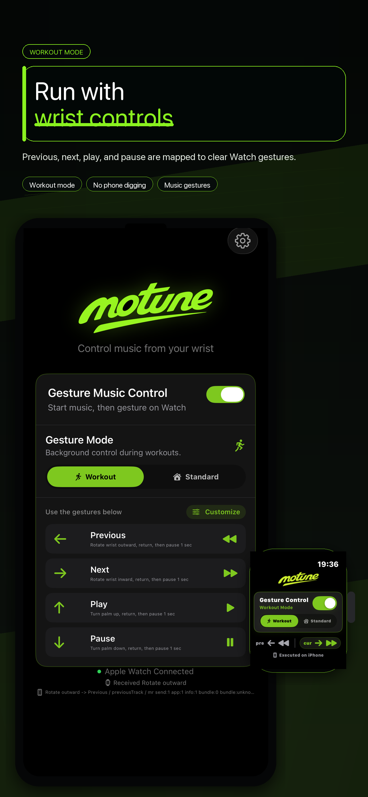
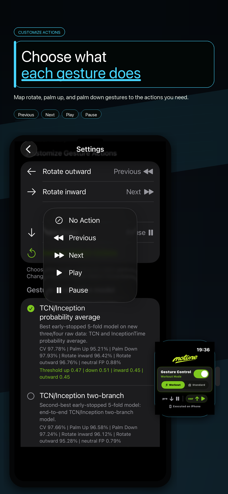
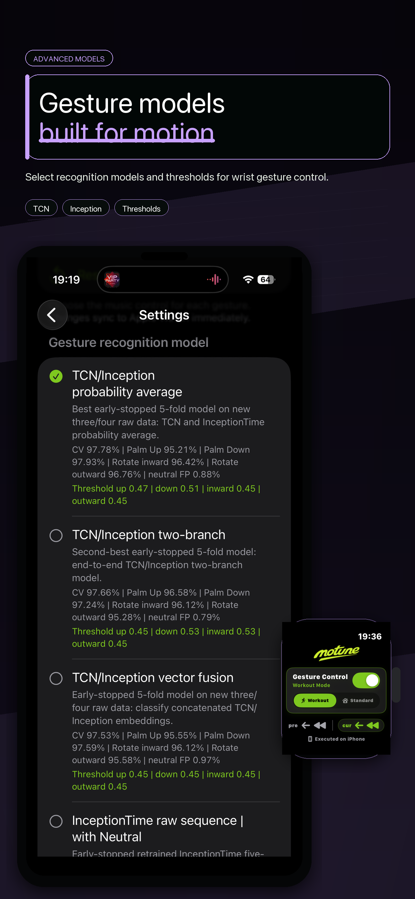
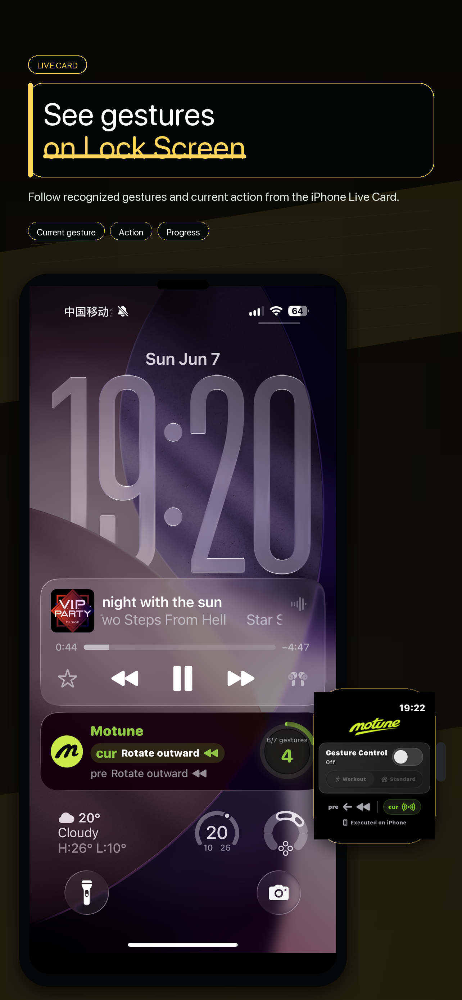
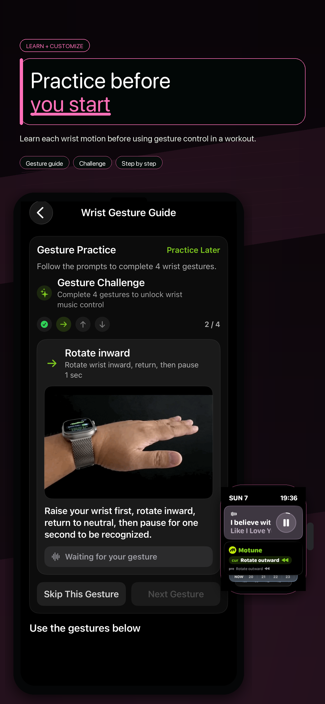

<section class="hero">
  

    
    
Apple Watch gesture music remote

    <h1>이어버드를 만지지 않고, Siri에게 말하지 않고, 손목으로 음악을 제어하세요.</h1>
    
Motune은 Apple Watch를 음악용 손목 제스처 리모컨으로 바꿉니다. 달리기, 자전거, 출퇴근, 겨울 장갑, 오픈이어 헤드폰, 이어버드 오작동, 화면 탭이나 음성 명령이 불편한 순간을 위해 만들었습니다.

    
<a href="https://apps.apple.com/us/app/motune/id6768014814?uo=4" class="button">App Store에서 다운로드</a><a href="support" class="button secondary">지원</a>

  

  

</section>

<section class="download-card">
  

Motune 다운로드
<h2>QR 코드로 App Store 열기.</h2>
다른 기기에서 QR 코드를 스캔하거나 iPhone에서 App Store 링크를 여세요.

  
<a href="https://apps.apple.com/us/app/motune/id6768014814?uo=4" class="app-store-badge compact" aria-label="Download Motune on the App Store"><small>Download on the</small><strong>App Store</strong></a>iPhone 카메라로 스캔

</section>

## 실제 음악 제어 불편함에서 출발

  
<h3>작은 이어버드 터치 대신</h3>
달리기, 땀, 착용 조정, 모자, 빠른 움직임 속에서 작은 터치와 스퀴즈는 오작동하기 쉽습니다.

  
<h3>어색한 음성 명령 대신</h3>
Siri는 유용하지만 공공장소, 바람, 교통 소음, 시끄러운 헬스장에서 음악 명령을 말하는 것은 느리거나 어색하거나 불안정할 수 있습니다.

  
<h3>작은 화면 탭 대신</h3>
Apple Watch Now Playing은 볼 수 있을 때 좋지만, 이동 중이나 장갑을 낀 상태에서는 작은 버튼을 누르는 것이 불편합니다.

  
<h3>움직이는 상황을 위해</h3>
재생, 일시정지, 다음 곡, 이전 곡을 손목 제스처로 제어합니다. 달리기, 자전거, 걷기, 출퇴근, 요리, 짐을 들 때 유용합니다.

## 사용자 이야기

  

러너
<h3>"달릴 때 이어버드 터치를 자꾸 놓쳐요."</h3>
Motune은 이어버드를 만지지 않고 명확한 손목 제스처로 다음 곡, 이전 곡, 재생, 일시정지를 제어합니다.

  

겨울 산책 사용자
<h3>"장갑을 끼면 작은 컨트롤이 귀찮아요."</h3>
장갑을 벗거나 휴대폰을 꺼내지 않고 Apple Watch 제스처로 음악을 제어할 수 있습니다.

  

자전거 / 오픈이어 사용자
<h3>"바람 속에서 Siri를 쓰거나 이어버드를 만지고 싶지 않아요."</h3>
Motune은 Shokz, 오픈이어, 골전도 헤드폰을 위한 손목 제어 레이어가 될 수 있습니다.

## V1.5 스크린샷

V1.5는 운동 모드 상태, 사용자 지정 제스처, 고급 인식 설정, 잠금 화면 Live Card, 제스처 연습을 개선했습니다.

  <figure><figcaption>운동 모드 손목 제어</figcaption></figure>
  <figure><figcaption>제스처 동작 선택</figcaption></figure>
  <figure><figcaption>고급 인식 모델</figcaption></figure>
  <figure><figcaption>잠금 화면 상태 표시</figcaption></figure>
  <figure><figcaption>사용 전 연습</figcaption></figure>

## Motune의 역할

Motune은 또 하나의 음악 플레이어가 아닙니다. 이미 사용하는 음악 앱을 위한 Apple Watch 손목 제스처 리모컨입니다. 음악을 재생하고 Motune 제스처 제어를 켜면 이어버드, Siri, 휴대폰 없이 기본 제어를 할 수 있습니다.

  
<h3>현재 재생 제어</h3>
Apple Music, Spotify 등 iPhone의 현재 미디어 재생 상태를 제어합니다.

  
<h3>Apple Watch 제스처</h3>
Apple Watch에서 의도적인 손목 움직임을 인식하고 iPhone으로 동작을 보냅니다.

  
<h3>표준 / 운동 모드</h3>
일상에서는 Watch App을 열고, 운동 중에는 사용자가 운동 모드를 시작할 수 있습니다.

  
<h3>사용자 지정 동작</h3>
기본 매핑을 유지하거나 동작을 바꾸거나 사용하지 않을 제스처를 끌 수 있습니다.

## 사용 방법

1. iPhone과 Apple Watch에 Motune을 설치합니다.
2. 음악 앱에서 재생을 시작합니다.
3. Motune을 열고 제스처 제어를 켭니다.
4. 표준 모드 또는 운동 모드를 선택합니다.
5. 명확한 손목 제스처를 하고 자연스러운 위치로 돌아간 뒤 1초 멈춥니다.
6. Motune이 Apple Watch에서 인식하고 iPhone의 현재 재생을 제어합니다.

## FAQ

  
<h3>이어버드에 컨트롤이 있는데 왜 Motune이 필요한가요?</h3>
이어버드 컨트롤은 유용하지만 달리기, 자전거, 땀, 장갑, 착용 조정 중에는 오작동하기 쉽습니다. Motune은 손목에서 제어하는 다른 선택지입니다.

  
<h3>Siri를 쓰면 안 되나요?</h3>
Siri도 가능하지만 곡 넘김이나 일시정지는 자주 발생하는 작은 동작입니다. 공공장소에서 말하기 어색하고 소음 속에서는 불안정할 수 있습니다.

  
<h3>Apple Watch Now Playing은요?</h3>
화면을 보고 누를 수 있을 때는 좋습니다. 달리기, 자전거, 출퇴근, 장갑, 짐을 든 상황에서는 눈을 쓰지 않는 손목 제스처가 더 빠를 수 있습니다.

  
<h3>Spotify, Apple Music, Shokz와 작동하나요?</h3>
Motune은 시스템 미디어 재생을 제어합니다. 현재 재생이 시스템 미디어 제어에 반응하면 Apple Music, Spotify, AirPods, Shokz, 오픈이어, 골전도 헤드폰에 유용할 수 있습니다.

## 안전 및 개인정보

- 계정 없음.
- 광고 없음.
- 타사 분석 SDK 없음.
- 앱 간 추적 없음.
- 모션 데이터는 제스처 인식을 위해 기기에서 처리됩니다.
- Motune은 음악 재생 제어 도구이며 의료, 응급, 내비게이션, 안전 필수 상황을 위한 앱이 아닙니다.

## 요구 사항

- iOS 18 이상 iPhone.
- watchOS 11 이상 Apple Watch.
- iPhone과 Apple Watch 모두에 Motune 설치.
- Apple Watch가 iPhone과 페어링 및 연결됨.
- Apple Watch 모션 권한.
- 운동 모드는 사용자가 시작할 때만 Health 권한이 필요합니다.

## 언어

- [English](en)
- [简体中文](zh-Hans)
- [繁體中文](zh-Hant)
- [日本語](ja)
- [한국어](ko)
- [Español](es)
- [Français](fr)
- [Deutsch](de)
- [العربية](ar)

## App Store Review Links

  <a href="privacy"><strong>Privacy Policy</strong>Data collection, motion data, Health permission, music playback data, and contact.</a>
  <a href="support"><strong>Support</strong>Requirements, setup steps, troubleshooting, Watch install help, and support email.</a>
  <a href="safety"><strong>Safety & Privacy</strong>No account, no ads, no tracking, local motion processing, and non-medical use.</a>
  <a href="requirements"><strong>Requirements</strong>iOS, watchOS, paired Apple Watch, Motion permission, and optional Health permission.</a>

